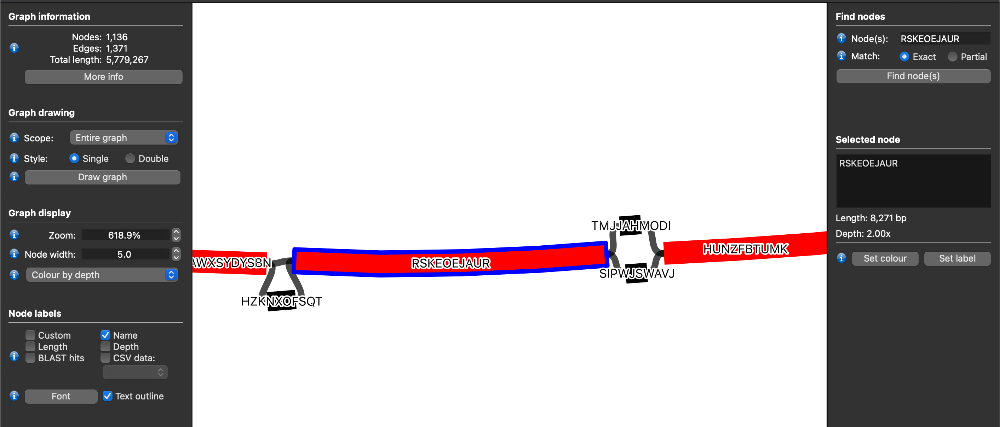

[Pangraph](https://github.com/neherlab/pangraph) is an annotation-free approach to building a pangenome graph data structure from sets of genomes. This repository contains a helper script to connect existing genome annotations (in [GFF3](https://www.ensembl.org/info/website/upload/gff3.html) format) to the 'pancontigs' of the graph.

It can add pancontig information to the attributes of gff features or produce a new gff with pancontigs as sequence regions.  

## Dependencies

Written in python, requires `pandas`:

```
conda create -n pangraph_annotations pandas
conda activate pangraph_annotations
```

## Usage

```
# Add pancontigs as attributes to original gff
# RECOMMENDED
python scripts/add_pancontigs_to_gff.py --pangraph {pangraph.json} \
    --input_gff {genome.gff} \
    --mode attributes \
    --output_gff {pancontigs_as_attributes.gff}
# Or: add pancontigs as regions
# WARNING: abuse of the GFF3 format!
python scripts/add_pancontigs_to_gff.py --pangraph {pangraph.json}\
    --input_gff {genome.gff} \
    --mode regions \
    --output_gff {pancontigs_as_regions.gff}
```

Output files will have the original header with an additional header-string e.g.

```
#!pancontig information relative to data/pangraph.json added on 03/07/2023, 10:33:55
```

## Example dataset

Our example data are two *Escherichia coli* genomes: [NZ_CP103755.1](https://www.ncbi.nlm.nih.gov/nuccore/NZ_CP103755.1) and [NC_000913.3](https://www.ncbi.nlm.nih.gov/nuccore/NC_000913.3). 

Their genomes are in `data/input_genomes.fa`, along with gff3 data on feature annotations. 

First, we build a pangraph with

```
pangraph build --circular data/input_genomes.fa > data/pangraph.json
# should take several minutes on a typical laptop
```

### Understanding the output

Then, we combine the existing annotations for `NZ_CP103755.1` with this pangraph as follows:

```
python scripts/add_pancontigs_to_gff.py --pangraph data/pangraph.json \
    --input_gff data/NZ_CP103755.1.gff3 \
    --mode attributes \
    --output_gff output/pancontigs_as_attributes.gff
```

This adds pancontig information as an attribute to each annotated feature. We can also do the same command using `--mode regions --output_gff output/pancontigs_as_regions.gff`. 

For a single feature, the output gff will look something like the following:

In `output/pancontigs_as_attributes.gff`:

```
NZ_CP103755.1   RefSeq  gene    1409    2509    .       +       .       ID=gene-NYO14_RS00010;Name=dnaN;pancontigs=FUZWWRHODH-_1
```

Pancontig information is stored as an attribute `pancontigs` which is a comma-separated of pancontig ID (`FUZWWRHODH`), strand (`-`, negative), and pancontig occurrence (`1` - some pancontigs may occur multiple times within a genome).

Alternatively, the same feature in `output/pancontigs_as_regions.gff` will look the following:

```
FUZWWRHODH  NZ_CP103755.1   gene    3558    4658    .   +   .   ID=gene-NYO14_RS00010;Name=dnaN;pancontigID=FUZWWRHODH;pancontigStrand=-;pancontigN=1
```

Here, pancontig ID is stored as the region (first entry). Coordinates of the feature now in terms of the pancontigs i.e. `1` is first base of the pancontig sequence in genome `NZ_CP103755.1`. (Note that this is in terms of the specific sequence in that genome, *not* the consensus sequence of the pancontig.) The attributes still include pancontig `ID`, `Strand` (`-/+`)and `N` (occurrence). The `ID` in the attributes has ID of the 'parent' annotation in the original GFF, with `-fragmentX` added if the feature has been fragmented. 

### Understanding duplicated genes

Bacterial genomes can contain multiple copies of genes. For example, *E. coli* typically has [seven copies](https://www.pnas.org/doi/10.1073/pnas.96.5.1971#:~:text=Each%20of%20the%20seven) of rRNA genes in different genomic locations, each time as part of the *rrn* operon containing 5S, 16S and 23S.

If we search for 16 rRNA we can confirm that this is the case:

```
awk '$3=="rRNA"' output/pancontigs_as_attributes.gff | grep "16S" | awk -F '\t' '{print $4,$5,$9}' | sed -e 's/ID.*pancontigs=//g'
# 454337 455878 BFXNRUIRZJ+_6
# 1307507 1309048 BFXNRUIRZJ+_7
# 4069015 4070556 BFXNRUIRZJ-_1
# 4951804 4953345 BFXNRUIRZJ-_2
# 4992072 4993613 BFXNRUIRZJ-_3
# 5121127 5122668 BFXNRUIRZJ-_4
# 5235634 5237175 BFXNRUIRZJ-_5
```

There are 7 16S rRNA genes and they occur on 7 instances of the `BFXNRUIRZJ` pancontig, as expected. 


### Investigating fragmented genes

We can use the output files to work out things like how many gene features are in sequence regions fragmented across multiple pancontigs. (This uses the fact that the `pancontigs` attribute is a comma-separated list and counts up how many items are in the list.)

```
awk '$3=="gene"' output/pancontigs_as_attributes.gff | sed -e 's/.*pancontigs=//g' | awk -F "," ' { print NF } ' | sort -n | uniq -c 
#   4742 1
#    251 2
#     27 3
#      2 4
#      4 5
#      1 6
#      1 7
```

We see that the majority of genes are not fragmented across pancontigs (4742/5028, 94.3%). However, that means that 5.7% of gene features were split across multiple pancontigs in the pangraph. 

Here is an example of a gene across three pancontigs in `output/pancontigs_as_attributes.gff`:

```
NZ_CP103755.1   RefSeq  gene    4800275 4801918 .   +   .   ID=gene-NYO14_RS23905;Name=eptA;pancontigs=RSKEOEJAUR+_1,TMJJAHMODI-_1,HUNZFBTUMK-_1
```

The `eptA` gene has been split across the pancontigs `RSKEOEJAUR`, `TMJJAHMODI`, and `HUNZFBTUMK`.

If we export the pangraph (`pangraph export data/pangraph.json -p pangraph -o data/`) and inspect it in [Bandage](https://rrwick.github.io/Bandage/), then we can see what happens in the graph structure at these three blocks.

Here we have coloured nodes (pancontigs) by depth, so that red pancontigs appear in both genomes and black only in one. The pangraph shows differences in structure at this point: one genome has pancontig `TMJJAHMODI` and one has `SIPWJSWAVJ`:



The `eptA` gene spans across this region, leading to fragmentation when mapped onto the pangraph.


### Possible reasons for fragmentation

The difference in genome structure *within* a gene might be caused by sequence divergence leading to splitting of pancontigs. In fact, inspecting pancontigs `TMJJAHMODI` and `SIPWJSWAVJ`, both are 211bp long. 

If we rerun pangraph with increased divergence tolerance (`-s` parameter), we may reduce fragmentation:

```
# Build a new pangraph
pangraph build --circular data/input_genomes.fa -s 20 > data/pangraph-s20.json
# Add features to the new pangraph
python add_pancontigs_to_gff.py --input_gff data/NZ_CP103755.1.gff3 --pangraph data/pangraph-s20.json --output_gff output/pancontigs_as_attributes-s20.gff --mode attributes
```

Inspecting the `eptA` gene, we find that it is now in a single pancontig:

```
NZ_CP103755.1   RefSeq  gene    4800275 4801918 .   +   .   ID=gene-NYO14_RS23905;Name=eptA;pancontigs=CPNIVTTNFW+_1
```

If we investigate feature fragmentation across the genome, we find it has slightly decreased to 4.9%. 

(TO ADD: using mmseqs2)


